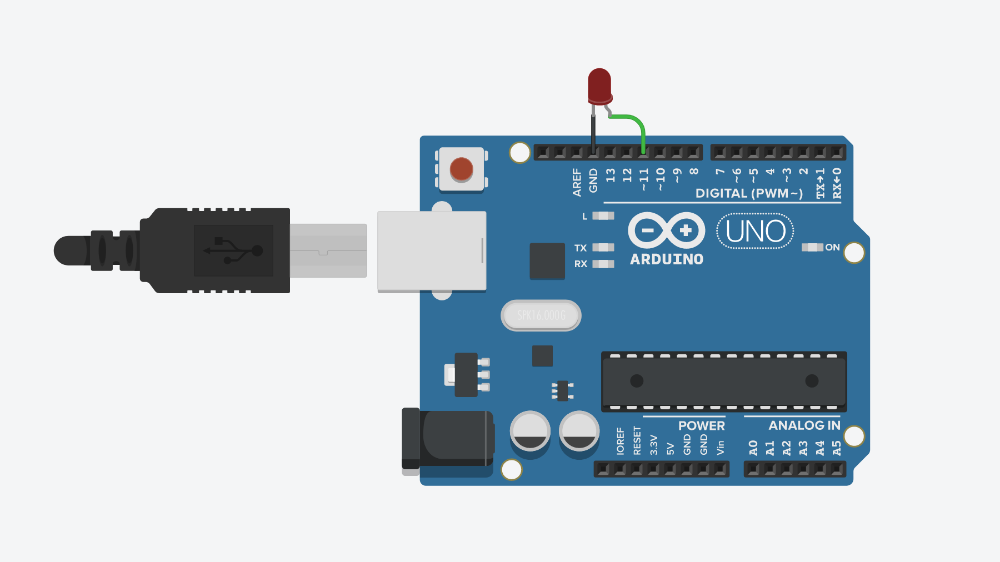
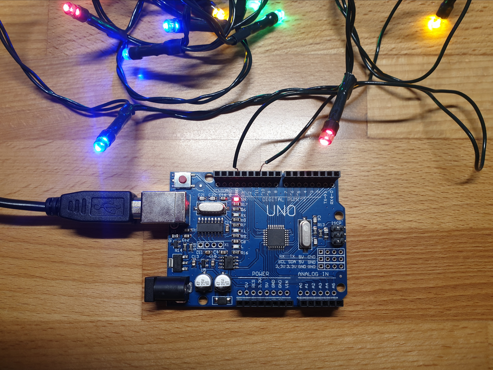
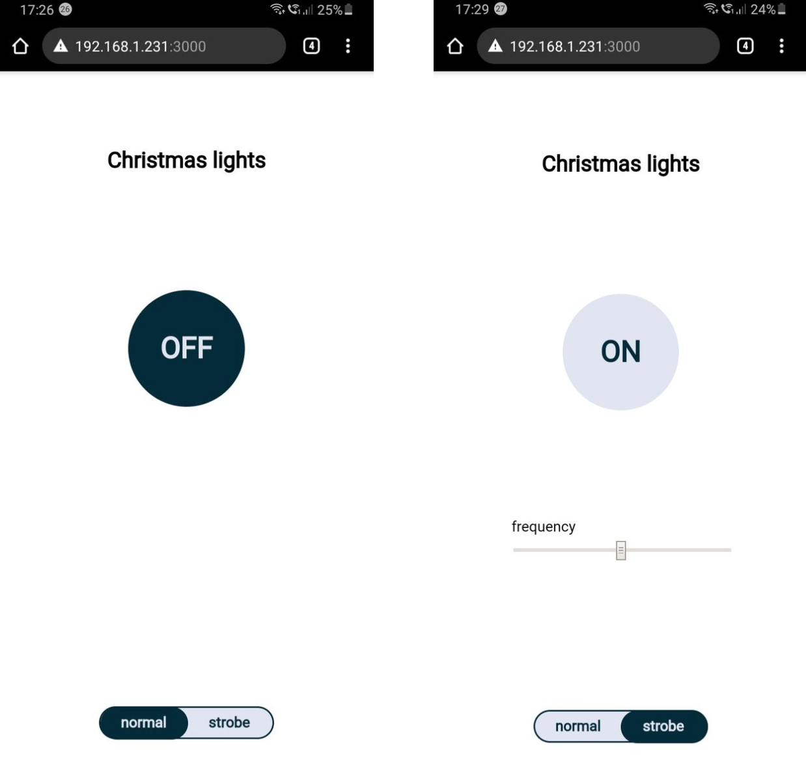

# SPIN

# Zdalnie sterowanie lampki choinkowe z serwerem i aplikacją webową

---

## Projekt

Autor: Michał Tułowiecki

---

## Cel:

W projekcie od początku chciałem wykorzystać Node.js. To środowisko w którym pracuje na codzień. Stwierdziłem, że ten projekt to fajna opcja żeby wykorzystać JavaScript do zastosowań *Internet of Things*. Tak zrodził się pomysł zrobienia zdalnie sterowanych lampek choinkowych z serwerem i aplikacją webową.

---

## Krok 1: Arduino



Układ podłączamy według schematu powyżej. W moim przypadku do portu 11 podłączyłem gotowy mini-łańcuch choinkowy. 



W Arduino IDE na płytkę wgrywamy StandardFirmataPlus. Wgranie protokołu Firmata pozwoli  na komunikację z serwerem.

[Standard Firmata Plus firmware backup for Johnny Five](https://gist.github.com/cookiengineer/4f292c952209e0f74d4c18b995dac855)

---

## Krok 2: Back-end

Serwer został napisany w języku [TypeScript](https://www.typescriptlang.org/). Zbudowany głównie przy użyciu popularnego frameworka [Express.js](https://expressjs.com/). Komunikację z płytką umożliwia platforma [Johnny-Five](http://johnny-five.io/).

```tsx
import {Board} from 'johnny-five'
import * as express from 'express'
import * as morgan from 'morgan'
import config from "./config";

import ledRouter from './resources/led.router'

export const board = new Board();
export const app = express()

app.disable('x-powered-by')
app.use(morgan('tiny'))

app.use('/led', ledRouter)

export const start = async () => {
    try {
        board.on("ready", () => {
            app.listen(config.port, () => {
                console.log(`app listening at http://localhost:${config.port}`)
            })
        })
    } catch (e) {
        console.error(e)
    }
}
```

API posiada 4 endpointy: 

1. `GET /led/:pin/on` - włącza diodę LED podłączoną do portu `id`

    ```tsx
    const turnOn = (req: Request, res: Response) => {
        try {
            const pin = Number(req.params.pin)
            if (!leds[pin]) leds[pin] = new Led(pin)
            leds[pin].fadeIn(500)
            return res.status(200).end()
        } catch (e) {
            console.error(e)
            return res.status(400).end()
        }
    }
    ```

2. `GET /led/:pin/off` - wyłącza diodę LED podłączoną do portu `id`

    ```tsx
    const turnOff = (req: Request, res: Response) => {
        try {
            const pin = Number(req.params.pin)
            if (!leds[pin]) leds[pin] = new Led(pin)
            leds[pin].stop(0);
            leds[pin].fadeOut(500)
            leds[pin].off()
            return res.status(200).end();
        } catch (e) {
            console.error(e)
            return res.status(400).end()
        }
    }
    ```

3. `GET /led/:id/strobe/:frequency` - tryb stroboskobowy/ migania diody LED podłączonej do portu `id` z częstotliwością `frequency` (ms).

    ```tsx
    const strobe = (req: Request, res: Response) => {
        try {
            const pin = Number(req.params.pin)
            if (!leds[pin]) leds[pin] = new Led(pin)
            const frequency = Number(req.params.frequency)
            leds[pin].strobe(frequency)
            return res.status(200).end()
        } catch (e) {
            console.error(e)
            return res.status(400).end()
        }
    }
    ```

4. `GET /led/:id/state` - zwraca true/ false w zależności od czego czy dioda LED podłączona do portu `id` jest włączona czy nie.

    ```tsx
    const state = (req: Request, res: Response) => {
        try {
            const pin = Number(req.params.pin)
            if (!leds[pin]) res.send(false);
            new Pin(pin).query((state) => res.send(state))
        } catch (e) {
            console.error(e)
            return res.status(400).end()
        }
    }
    ```

Całość kodu dostępna w repozytorium w linku poniżej.

[tulski/IoT-smart-light](https://github.com/tulski/IoT-smart-light/tree/master/server)

---

## Krok 3: Front-end

Aplikacja webowa napisana przy użyciu [Reacta](https://pl.reactjs.org/). Ostylowana przy pomocy [Styled Components](https://styled-components.com/) i animowana przy pomocy [Framer Motion](https://www.framer.com/motion/). Całość napisana w języku JavaScript.

```tsx
import React, { useState, useEffect } from "react";
import styled from "styled-components";
import Switch from "./Switch";
import OptionToggle from "./OptionToggle";
import Slider from "./Slider";

const Wrapper = styled.div`
  background: #ffffff;
  height: 100%;
  width: 100%;
  display: grid;
  align-items: center;
  justify-items: center;
  justify-content: center;
  grid-template-rows: repeat(4, 1fr);
`;

const Heading = styled.h2``;

const Root = () => {
  const [state, setState] = useState(false);
  const [option, setOption] = useState("normal");
  const [frequency, setFrequency] = useState(500);
  const toggleState = () => setState(!state);
  const toggleOption = () =>
    setOption(option === "normal" ? "strobe" : "normal");

  useEffect(() => {
    if (!state)
      fetch(`http://192.168.1.231:1234/led/11/off`).then(() => setState(false));
    if (state && option === "normal")
      fetch(`http://192.168.1.231:1234/led/11/on`).then(() => setState(true));
  }, [state, option]);

  useEffect(() => {
    if (state && option === "strobe")
      fetch(`http://192.168.1.231:1234/led/11/strobe/${frequency}`);
  }, [state, option, frequency]);

  return (
    <Wrapper>
      <Heading>Christmas lights</Heading>
      <Switch state={state} toggleState={toggleState} />
      {option === "strobe" && (
        <Slider frequency={frequency} setFrequency={setFrequency} />
      )}
      <OptionToggle option={option} toggleOption={toggleOption} />
    </Wrapper>
  );
};

export default Root;
```

Całość kodu dostępna w repozytorium w linku poniżej.

[tulski/IoT-smart-light](https://github.com/tulski/IoT-smart-light/tree/master/app)

Layout aplikacji został stworzony z myślą o urządzeniach mobilnych. 




---

## Działanie

[IoT Smart Light](https://www.youtube.com/watch?v=HLJViBGKbBo)
